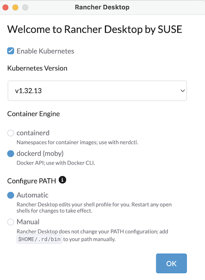
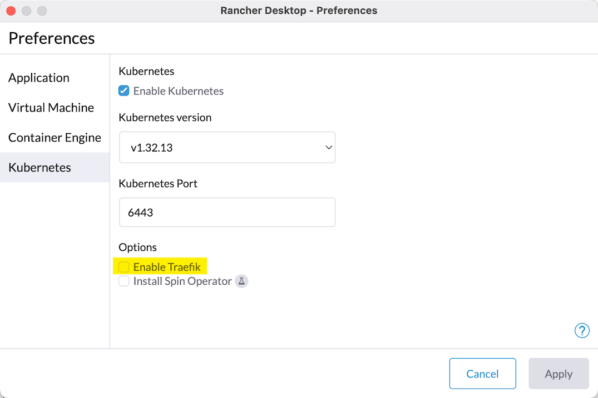
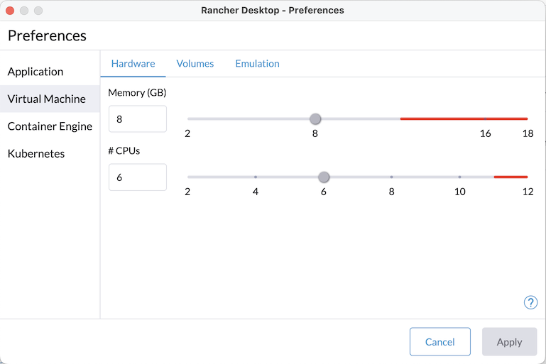

# Agent Manager Installer for Rancher Desktop

Rancher desktop allows you to easily run a 1-node Kubernetes cluster for local testing. This guide helps you install Agent Manager on an existing cluster using a shell script which installs the pre-requisiites and the product itself. 

## Rancher Desktop installation 

Following steps have been tested on MacOS and installation was done using brew : `brew install rancher` - If you use a different platform, refer to the documentation here: https://docs.rancherdesktop.io/getting-started/installation/

Installing Rancher desktop also provisions kubectl, helm as well as some docker commands which are all required to install Agent Manager 

> [!IMPORTANT]
>
> Once Rancher Desktop is installed, start a *new* terminal to execute the script, so that your PATH is updated - The script checks for prereqs and if they can't be found, it is most likely because you're executing from a shell that was opened before Rancher was installed.

> [!WARNING]
>
> Agent Manager requires **Helm v3.12+**, but recent Rancher Desktop versions bundle **Helm 4** as `helm` on PATH. Helm 4's hook lifecycle (used by cert-manager's `startupapicheck`, the Agent Sandbox Module, and others installed here) has been observed to hang indefinitely on this setup — confirmed by re-running the exact same chart install with Helm 3, which succeeded in seconds every time Helm 4 hung. The installer checks for this and exits early with a fix if it detects Helm 4+. To install Helm 3 alongside Rancher Desktop's Helm 4: `brew install helm@3`, then put it ahead on PATH: `export PATH="/opt/homebrew/opt/helm@3/bin:$PATH"` (it's keg-only, so this won't disturb the existing `helm` link).

## Cluster Configuration

When you start Rancher Desktop, it provisions a Kubernetes cluster automatically. However we need to edit some preferences before installing. A window will pop up where you can set a few options. 

- Select Kubernetes version to be `v1.32.x` or `v1.33.13`(which is what Agent Manager supports) - Later versions could be problematic due to CRDs versions installed by default.
- Select dockerd (moby)
- You can configure the path changes yourself or let the installer do it. Either way, make sure you open a new shell !



Let the cluster start properly, then open Rancher Desktop Preferences.

1.Disable Traefik



2.CPU and Memory- Give it as much as you can. Minimum configuration is 8Gb memory and 4 CPUs.



3.Apply changes. This restarts the cluster. 

You are ready to install!

## Agent Manager installation

The script mirrors the official instructions at https://wso2.github.io/agent-manager/docs/v1.0.0-rc3/guides/on-your-environment/ and tracks the **v1.0.0-rc3** pre-release. Where it departs from the docs, the reason is written in a comment at that point in the script — most of the departures exist because the docs assume a cloud cluster where each plane owns its own LoadBalancer, whereas a single-node k3s shares one host.

> [!IMPORTANT]
>
> **The OpenChoreo planes are installed at 1.2.1, not the 1.2.0 the RC3 guide pins.** 1.2.1 is the version the OpenChoreo k3d single-cluster quick-start runs, i.e. an exercised pairing, and every value this script sets was checked against it. The floor is 1.2.0 regardless: the platform-resources extension creates `ProjectType` and `ProjectReleaseBinding` resources, and those CRDs do not exist before OpenChoreo **1.2.0**.

### Profiles

> [!IMPORTANT]
>
> **Only `PROFILE=local` is supported today.** It is the default, and it is the one that has been run end to end. `PROFILE=cloud` is written but has never completed a verified install, so the script **refuses to run it** — it exits immediately with an explanation.
>
> The cloud column below documents the intended behaviour, not proven behaviour. If you want to help test it, use a cluster you can throw away:
>
> ```shell
> ALLOW_UNTESTED_CLOUD=1 PROFILE=cloud ./scripts/amp-install-rancher.sh install
> ```
>
> The reason for the guard rather than a warning: the cloud profile changes the base domain, all six gateway ports, the TLS issuer, the registry and secret generation. A partial run reconfigures a cluster in place instead of stopping cleanly, so it is not something to discover halfway through.

The script has two profiles, selected with the `PROFILE` environment variable. They cannot be mixed on one cluster: Thunder's issuer and the API gateway's registered vhost are written once at first install and are never reconciled afterwards, so switching means discarding Thunder's data (and, with it, Agent Manager's tenant data).

| | `PROFILE=local` (default) |
|---|---|
| Target | Rancher Desktop / k3s |
| Base domain | `amp.test` |
| Scheme | HTTPS (self-signed CA) |
| Control-plane gateway | 8080 / 443 |
| Data-plane gateway | 19080 / 19443 |
| Observability gateway | 11080 / 11085 |
| DNS | `/etc/hosts` + a CoreDNS rewrite |
| Works offline | **yes** |
| Registry | CNCF Distribution, deployed in-cluster |

Override the domain with `BASE_DOMAIN=…` if you want something other than the defaults.

#### Per-environment Thunder hostnames

Every Environment gets its own Thunder, reachable at `<handle>.<base-domain>` through the `*.<base-domain>` wildcard. RC2 treats that handle as **unguessable on purpose** — it is the only thing between a published DNS name and an environment's identity provider. The two profiles differ deliberately:

| | handle | why |
|---|---|---|
| `local` | pinned to `default-idp` | Nothing is publicly resolvable — the name exists only in `/etc/hosts` and a CoreDNS rewrite — so unguessability buys nothing, while a fixed label lets [scripts/amp-hosts.sh](scripts/amp-hosts.sh) write the entry without querying the cluster. |
| `cloud` | generated by Agent Manager | The host really is published there, so the installer leaves `THUNDER_HANDLE` unset and Agent Manager mints a 10-character handle. |

Because the cloud handle isn't knowable in advance, the installer **reads the issuer back** from the provisioning output rather than computing it. Registration is an idempotent upsert, so re-running reports the same stored handle. If that read-back ever fails on `cloud` the installer stops rather than guess — the issuer is immutable once minted, and a wrong one registered with the gateway makes every AgentID token fail validation with nothing in the logs pointing at the cause.

### Offline operation

The `local` profile is designed to work with **no Internet connection** once installed. (The install itself still needs the network — Helm charts come from ghcr.io, quay.io and GitHub.)

This is why it does not use `nip.io`, which the earlier alpha1 version of this script relied on: `nip.io` is a public DNS service and resolves nothing when you are offline. Instead, two resolvers are configured for the same real hostnames:

- **Pods** resolve them through a `coredns-custom` ConfigMap the installer applies, which rewrites each domain onto the right gateway `Service`. This is the same mechanism the upstream k3d layout uses. It matters for agents' OTLP exporters, the API gateway and env-Thunder, all of which dial these names from inside the cluster.
- **Your Mac** resolves them through `/etc/hosts`, pointing at `127.0.0.1` — Rancher Desktop's ssh forwarder binds every LoadBalancer port on the host, so this reaches each plane gateway on its own port and, unlike the VM's IP address, does not change when the VM restarts.

`.localhost` is not an option for either side, which is worth knowing if you are tempted: macOS does not resolve multi-label `.localhost` names (`getaddrinfo("console.amp.localhost")` and `curl` both fail), and Go and Python resolvers inside pods do not special-case it either.

> [!NOTE]
>
> **env-Thunder rejects a plain-HTTP JWKS URL.** The per-environment Thunder validates its trusted-issuer JWKS URL at config load and refuses anything but HTTPS unless the host is `localhost`:
>
> ```
> trusted_issuer.jwks_url must use https (got http://…); http is only allowed for localhost
> ```
>
> That crash-loops the chart's pre-install setup Job until it hits its backoff limit, at which point the Job **deletes its pod** — so `kubectl logs` is empty and the only visible symptom is `failed pre-install: job … BackoffLimitExceeded`. The installer points it at `https://thunder.<base>/oauth2/jwks` and mounts the CA from the `openchoreo-ca-secret` in `cert-manager`.

Manage the host entries with the helper:

```shell
scripts/amp-hosts.sh print              # show the block, change nothing
scripts/amp-hosts.sh add                # append/refresh it (needs sudo)
scripts/amp-hosts.sh add myproject      # ... plus a host for a project you created
scripts/amp-hosts.sh remove             # delete it
```

`/etc/hosts` has no wildcards, so each project you create needs its own line — agent invoke hostnames are `<org>-<project>.agents.<base-domain>`.

### Running it

Make it executable and run it:

```shell
./scripts/amp-install-rancher.sh install
```

The `install` verb is required: running the script with no arguments prints its help instead of installing, so nothing starts by accident. After the pre-flight checks it shows the target cluster and waits for confirmation:

```
────────────────────────────────────────────────────────────────
 About to install WSO2 Agent Manager v1.0.0-rc3
────────────────────────────────────────────────────────────────
  Context:      rancher-desktop
  Cluster:      https://127.0.0.1:6443
  Profile:      local
  Base domain:  amp.test
  TLS mode:     selfsigned
  Namespaces:   wso2-amp, openchoreo-{control,data,workflow,observability}-plane,
                amp-thunder, openbao, cert-manager, external-secrets

  Takes roughly 40 minutes and modifies the cluster above.

  Proceed? [y/N]
```

**Check the context line.** Every pre-flight check passes just as happily against a healthy cluster that isn't the one you meant — `kubectl`'s current context is ambient state, possibly set in another terminal hours ago, and this is the only place it is shown. Add `--yes` to skip the prompt; it is required when stdin is not a terminal, so an unattended job cannot silently install into the wrong place.

`local` is the default profile and the only supported one. 

The script runs in phases — prerequisites, OpenChoreo, then Agent Manager — with validation embedded in each step. Be patient: some steps take several minutes depending on the memory and CPU allotted to the VM, and the observability plane alone can take 25.

If all goes well you should see something like this at the end:

```shell
Pod Status:
  ✓ openchoreo-control-plane: 6/6 pods Running
  ✓ openchoreo-data-plane: 6/6 pods Running
  ✓ openchoreo-workflow-plane: 2/2 pods Running
  ✓ openchoreo-observability-plane: 17/17 pods Running
  ✓ wso2-amp: 3/3 pods Running
  ✓ amp-thunder: 2/2 pods Running
  ✓ amp-thunder-default-default: 1/1 pods Running

Gateway registration (write-once):
  ✓ vhost: https://default-default.agents.amp.test:19443

Access URLs:
  Console:      https://console.amp.test
  API:          https://api-amp.amp.test
  Thunder:      https://thunder.amp.test
  Observer:     https://traces.amp.test:11085
  Agents:       https://<org>-<project>.agents.amp.test:19443
  OTLP ingest:  https://default-default.agents.amp.test:19443/otel
  env-Thunder:  https://default-idp.amp.test

Credentials:
  Console admin:  admin / <generated>

Trust the CA (one time, required):
  ...

✓ Installation completed successfully!
```

> [!IMPORTANT]
>
> The console password is **not** `admin/admin`. It is generated at install time into the `amp-admin-credentials` Secret and printed in the summary above. Retrieve it later with:
> ```shell
> kubectl get secret amp-admin-credentials -n amp-thunder -o jsonpath='{.data.password}' | base64 -d
> ```

> [!IMPORTANT]
>
> The gateway's registered **vhost is write-once**. The bootstrap job writes it into Agent Manager at first registration; every later run finds the gateway already present, logs `already exists`, and exits without reconciling. A `helm upgrade` with corrected values changes nothing and reports no error — the console just keeps showing whatever was registered first. The summary checks this explicitly. If it shows a `.localhost` host, the only fix is to delete the gateway registration and re-register.

> [!NOTE]
>
> Execution of the script is idempotent. You can run it multiple times, even if for some reason it fails to execute at some point.

### Why the local profile is HTTPS

Both consoles depend on browser APIs that only exist in a [secure context](https://developer.mozilla.org/en-US/docs/Web/Security/Secure_Contexts), so over plain HTTP on a non-`localhost` origin they are simply absent — and both failures are invisible from the server side:

| API | Used by | Symptom over plain HTTP |
|---|---|---|
| `crypto.subtle` | Thunder console — verifies the ID token's signature | Sign-in redirects in a silent loop. A token *is* issued, its `aud` is correct, and every server-side request returns `200`; the SDK discards the valid token and bounces back to `/authorize`, where the live session re-issues at once |
| `navigator.clipboard` | AMP console — every copy button | Copy icons do nothing |

Because they come from the self-signed `openchoreo-ca` chain, **that CA has to be trusted before any of it loads in a browser.** The installer prints this at the end rather than running it for you:

```shell
kubectl get secret openchoreo-ca-secret -n cert-manager \
  -o jsonpath='{.data.ca\.crt}' | base64 -d > /tmp/openchoreo-ca.crt
sudo security add-trusted-cert -d -r trustRoot \
  -k /Library/Keychains/System.keychain /tmp/openchoreo-ca.crt
```

Then quit and reopen the browser completely.

> [!NOTE]
>
> **Under HTTPS the control-plane gateway must be on 443.**

### Secret store (OpenBao)

RC3 installs OpenBao with `bao server -dev`, which keeps everything **in memory**. Any interruption of the pod — a laptop sleep, an OOM kill, a VM restart — silently discards every secret written since install.

What makes it hard to spot is that the platform appears to recover: dev mode's `postStart` hook re-seeds the platform's *own* placeholder secrets on every start, so the console, Thunder and the gateways all keep working. Only what was written at **runtime** is gone — agent API keys above all. The next agent you create fails with a 500 whose text never mentions OpenBao:

```
failed to store secrets in KV: failed to upsert secret:
  failed to check secret existence: unexpected error: status 501
```

This installer uses [scripts/openbao-values.yaml](scripts/openbao-values.yaml) instead: real server mode, `file` storage on a retained PVC, initialised and unsealed by the installer, and re-unsealed after any restart by a small sidecar.

> [!IMPORTANT]
>
> **This is a durability fix, not a security one.** The unseal key is stored in a Kubernetes Secret in the same namespace, so anyone who can read Secrets there can unseal the store — as with any auto-unseal setup. The alternatives don't fit a laptop: manual unsealing after every restart is unusable, and KMS auto-unseal needs a cloud provider, which breaks the offline requirement. For the same reason there is a single unseal key rather than the usual five shares — splitting a key five ways and storing all five shares in one Secret is ceremony, not safety.
>
> For a real deployment, replace the `seal` stanza with a KMS seal (`awskms`, `gcpckms`, `azurekeyvault`, or `transit` against a separate OpenBao) and delete the unsealer sidecar. The storage layout is unchanged, so no data migration is involved.

Recovering the root token, should you need it:

```shell
kubectl get secret openbao-root-token -n openbao -o jsonpath='{.data.root-token}' | base64 -d
```

> [!WARNING]
>
> `scripts/amp-uninstall-rancher.sh` deletes the `openbao` namespace, which destroys both the data volume (`data-openbao-0`) and the unseal key. Agent API keys are not recoverable afterwards.

### Container registry

RC2 makes registry configuration load-bearing: build workflows push each agent image, and the chart default (`host.k3d.internal:10082`) does not resolve on Rancher Desktop. The failure surfaces only on the first agent build, long after the platform installs and verifies cleanly.

The `local` profile deploys **CNCF Distribution** in-cluster and points the platform at it. Distribution satisfies both of RC2's requirements: it creates repositories on push (each build pushes a uniquely-named `<workflow-run>-image`, so they cannot be pre-created — this is why ECR cannot be used), and it needs no rotating credentials. The installer also writes `/etc/rancher/k3s/registries.yaml` inside the Lima VM via `rdctl` so kubelet will pull over plain HTTP.

It ships with **no authentication**. That is fine *only* for a cluster-local evaluation registry. To use your own registry instead:

```shell
DEPLOY_REGISTRY=false \
REGISTRY_ENDPOINT=registry.example.com:5000 \
REGISTRY_TLS_VERIFY=true \
  ./scripts/amp-install-rancher.sh install
```

## Sample agent

[samples/langchain-chat-agent/](samples/langchain-chat-agent/) is a minimal LangChain chat agent for verifying an install end to end — build, image push, deploy, invoke, and trace export. It builds with buildpacks (no Dockerfile), exposes `POST /chat`, and ships an `openapi.yaml` so the console's try-out renders a form. See its README for the endpoint and environment-variable configuration.

## Uninstalling Agent Manager

To remove everything the installer set up (for example, to reinstall a different version), run `scripts/amp-uninstall-rancher.sh`. It reverses the install script's steps: it removes the plane registrations, uninstalls all the Helm releases, and deletes the namespaces used by Agent Manager and OpenChoreo.

```shell
./scripts/amp-uninstall-rancher.sh
```

It also cleans up the cluster-scoped resources the installer creates via raw `kubectl apply` — a `ClusterSecretStore`, two `ClusterIssuer`s, a `ClusterRole`/`ClusterRoleBinding`, the Agent Sandbox CRDs and RBAC, the env-Thunder `HTTPRoute` (which lives in the control-plane namespace, because the shared gateway only admits routes from its own namespace), and the `coredns-custom` ConfigMap. None of these are part of a Helm release or of the namespaces being deleted, so they would otherwise survive uninstall unnoticed.

`/etc/hosts` is outside the cluster and is left alone — the entries point at `127.0.0.1` and are harmless across a reinstall onto the same base domain. The script reports if they are still present; remove them with `scripts/amp-hosts.sh remove`.

It asks for confirmation before touching the cluster (pass `-y`/`--yes` to skip the prompt), and finishes with a validation pass confirming no matching Helm releases, namespaces, plane registrations, or cluster-scoped extras remain, plus a check for any `PersistentVolume`s still referencing the deleted namespaces (worth a look if your StorageClass's reclaim policy is `Retain` rather than `Delete`).

Cluster-scoped CRDs (Gateway API, cert-manager) are intentionally left in place — they're shared infrastructure, not part of the Agent Manager release, and the installer already handles re-applying them safely on the next run.

> [!NOTE]
>
> A namespace can occasionally get stuck in `Terminating`. This happens when a custom resource inside it (e.g. a `RestAPI` from gateway-operator, or an `ExternalSecret`) still has a finalizer set, but the operator that owns that finalizer was already removed by the Helm uninstall step — so nothing is left to clear it. The script detects this automatically and force-clears any leftover finalizers on stuck namespaces so deletion can complete; if it still doesn't resolve, inspect the namespace's conditions for the specific resource holding it up:
>
> ```shell
> kubectl get namespace <ns> -o json | jq '.status.conditions'
> ```

